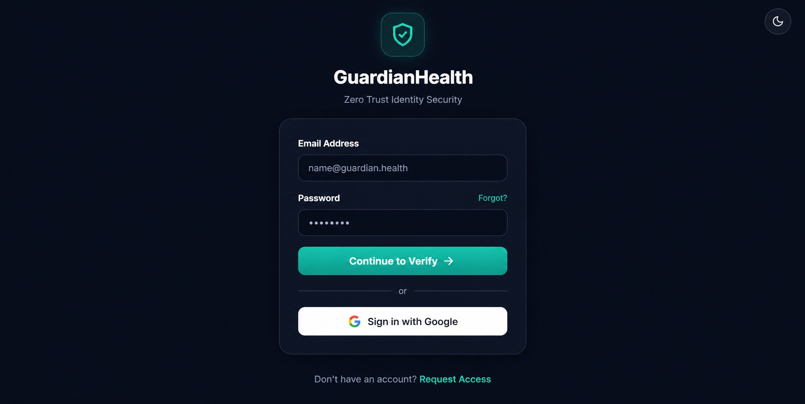
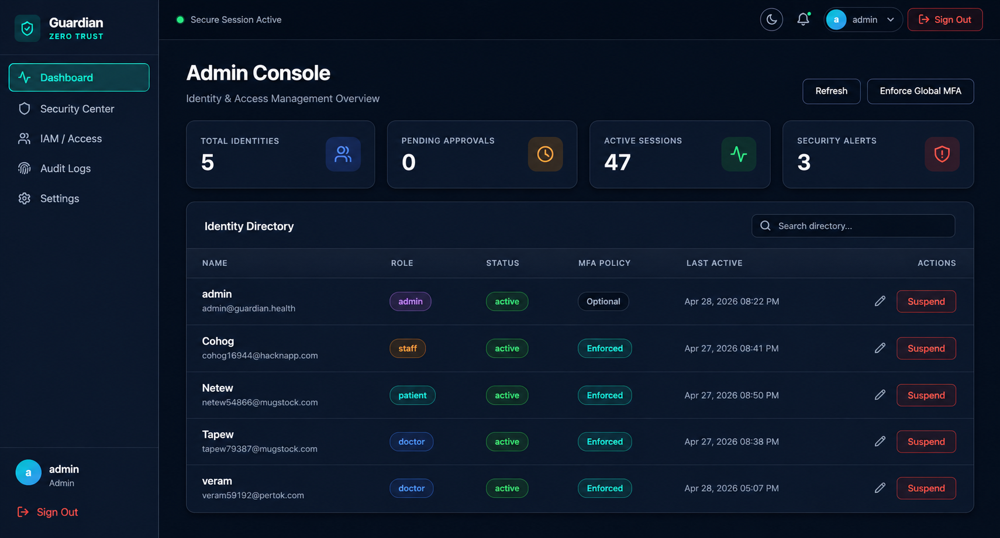
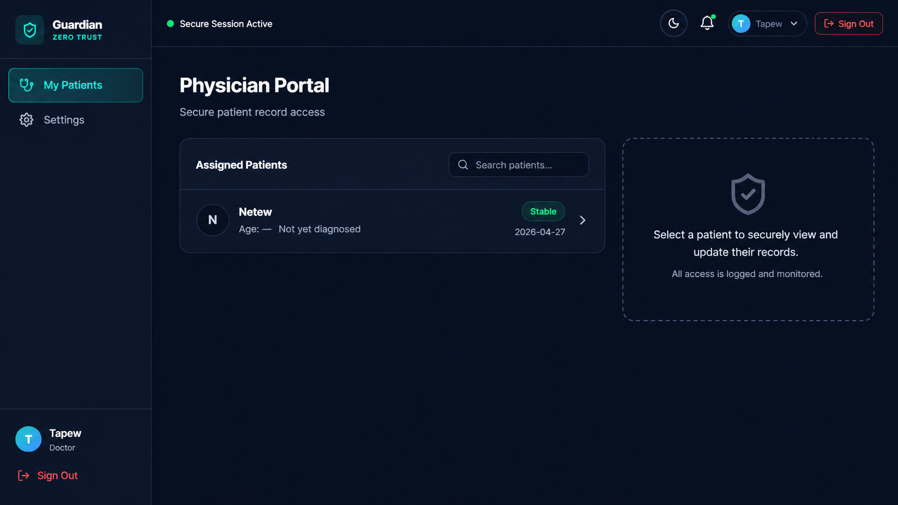
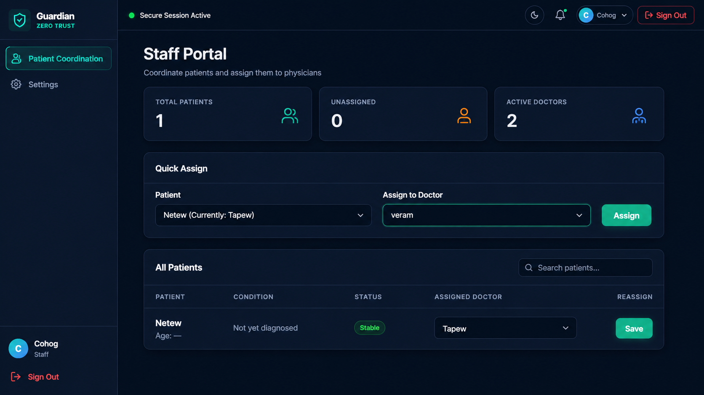
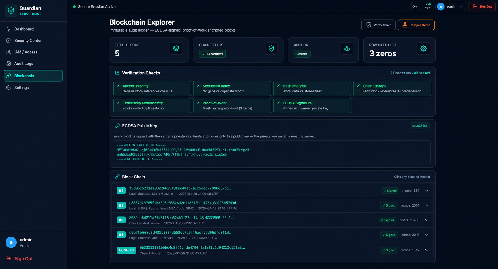

<h1 align="center">GuardianHealth</h1>

<p align="center">
  <b>Zero-Trust Identity & Access Management for Healthcare</b><br/>
  Secure logins, multi-factor auth, role-based access, and a tamper-evident audit trail — built with Flask & PostgreSQL.
</p>

<p align="center">
  
  
  
  
  
</p>

<p align="center">
  
</p>

---

## About

GuardianHealth is a healthcare-focused web app that gives clinical teams a secure, role-based way to manage users, patients, and care assignments — without leaving an editable trail behind. Every sensitive action is hashed, signed, and chained, so the audit log can be independently verified.

## Features

- 🔐 Email-based **Multi-Factor Authentication** on every login
- 👥 **Role-Based Access Control** — Admin · Doctor · Staff · Patient
- 🩺 **Patient ↔ Doctor assignment** workflow handled by staff
- 📋 **Vitals & clinical updates** restricted to the assigned doctor
- 🧱 **ECDSA-signed blockchain** audit trail (tamper-evident)
- 🛡️ Hardened against XSS, CSRF, SQL injection, clickjacking
- 🌗 Polished dark / light mode
- 📱 Responsive UI

## Tech Stack

**Backend** · Python 3.11 · Flask · psycopg2  
**Database** · PostgreSQL (Supabase)  
**Auth** · PyJWT · bcrypt · HMAC-SHA256  
**Crypto** · ECDSA (secp256k1) via `cryptography`  
**Frontend** · Jinja2 · Vanilla JS · Inter · Lucide Icons  
**Email** · SMTP (Brevo)

## Screenshots

<table>
  <tr>
    <td align="center">
      <b>Admin Dashboard</b><br/>
      
    </td>
    <td align="center">
      <b>Doctor Portal</b><br/>
      
    </td>
  </tr>
  <tr>
    <td align="center">
      <b>Staff Portal</b><br/>
      
    </td>
    <td align="center">
      <b>Blockchain Verification</b><br/>
      
    </td>
  </tr>
</table>

## Quick Start

```bash
# 1. Clone
git clone https://github.com/<you>/guardianhealth.git
cd guardianhealth

# 2. Install
python -m venv venv && source venv/bin/activate
pip install -r requirements.txt

# 3. Configure
cp .env.example .env       # then fill in your Supabase + SMTP secrets

# 4. Run
python app.py              # http://localhost:5000
```

> Tables and the genesis blockchain block are created automatically on first run.

## Roles

| Role    | Can do |
|---------|--------|
| Admin   | Manage users, view audit logs, verify the blockchain |
| Doctor  | View & update assigned patients (vitals, condition, status) |
| Staff   | Coordinate patients and assign them to doctors |
| Patient | View their own dashboard |

## Project Structure

```
guardianhealth/
├── app.py              # Flask app — routes, auth, RBAC
├── blockchain/         # ECDSA-signed append-only chain
├── templates/          # Jinja2 pages
├── static/             # CSS + JS
├── requirements.txt
└── .env.example
```

## License

[MIT](LICENSE) © GuardianHealth contributors

---

<p align="center"><i>Built for healthcare teams that take Zero Trust seriously.</i></p>
